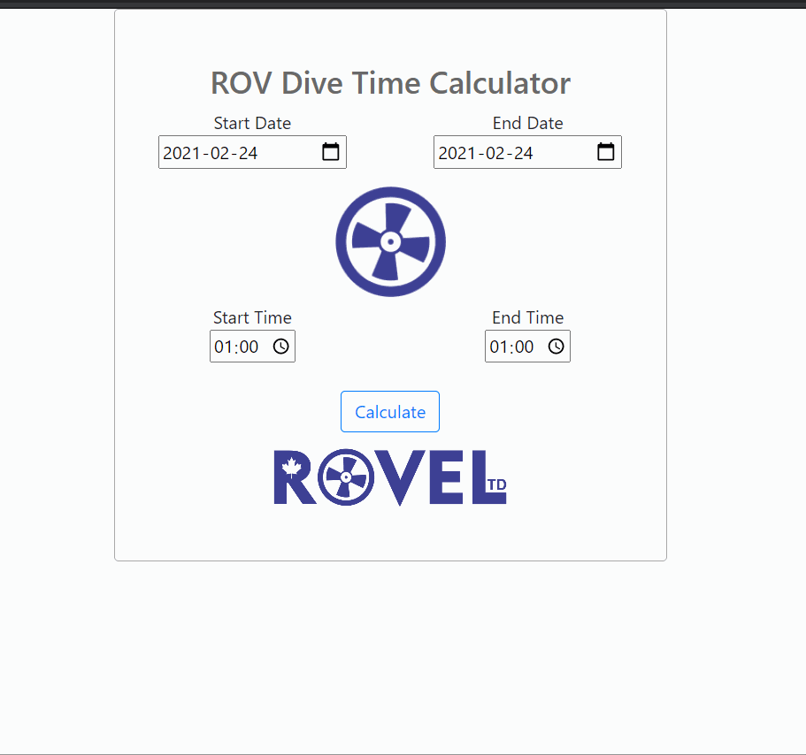

# ROVcalc   

  ROV Dive Time Calculator - created for ROV Team offshore to use during daily activities to calculate duration of Dive.
  This app can be used to calculate any duration betweeen two dates and times. Created using JS/HTML/CSS.
  
### Screenshot

## Usage

Enter start time and date and end time and date. Click on calculate or on thruster icon to get calculated duration.

Deployed app can be accessed at [http://rovel.ca/](http://rovel.ca/)

All app code is available at repository [https://github.com/elogonme/rovcalc](https://github.com/elogonme/rovcalc)

## License

Licensed under the 

## Questions

For any questions use contacts below:  
        :construction_worker: Developer: Eldar Humbatov  
        :email: Email: [elogon@gmail.com](mailto:elogon@gmail.com)  
        :boom: GitHub: [https://github.com/elogonme](https://github.com/elogonme)
  
  *Generated by [readme-generator](https://github.com/elogonme/readme-generator/)*
  